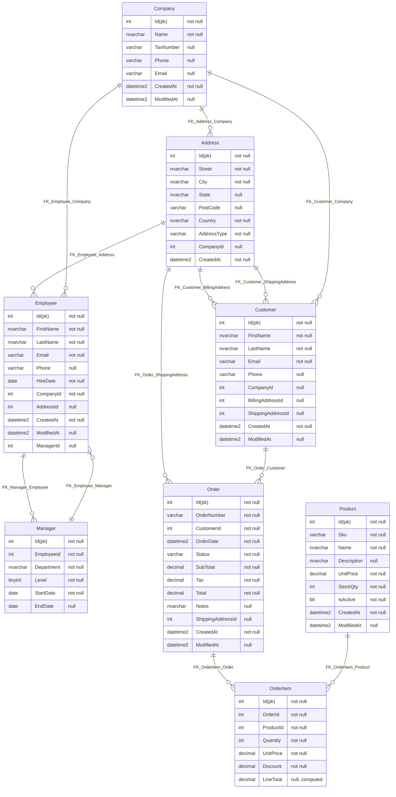
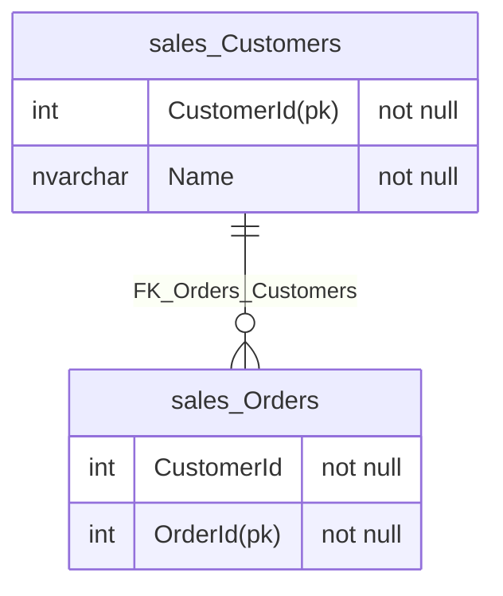

#  DbToMermaid

[](https://ci.appveyor.com/project/SimonCropp/dbtomermaid)
[](https://www.nuget.org/packages/SqlServerToMermaid/)
[](https://www.nuget.org/packages/EfToMermaid/)

Generate [Mermaid ER diagrams](https://mermaid.js.org/syntax/entityRelationshipDiagram.html) from SQL Server databases or Entity Framework Core models.


## NuGet

 * SqlServerToMermaid: https://nuget.org/packages/SqlServerToMermaid/
 * EfToMermaid: https://nuget.org/packages/EfToMermaid/


## SqlServerToMermaid

Renders Mermaid ER diagrams directly from a SQL Server database using SQL Server Management Objects (SMO).

### Schema

<!-- snippet: SampleSchema -->
<a id='snippet-SampleSchema'></a>
```cs
CREATE TABLE Company
(
    Id          INT IDENTITY(1,1) PRIMARY KEY,
    Name        NVARCHAR(200)   NOT NULL,
    TaxNumber   VARCHAR(50)     NULL,
    Phone       VARCHAR(30)     NULL,
    Email       VARCHAR(255)    NULL,
    CreatedAt   DATETIME2       NOT NULL DEFAULT GETUTCDATE(),
    ModifiedAt  DATETIME2       NULL
);

CREATE TABLE Address
(
    Id          INT IDENTITY(1,1) PRIMARY KEY,
    Street      NVARCHAR(200)   NOT NULL,
    City        NVARCHAR(100)   NOT NULL,
    State       NVARCHAR(100)   NULL,
    PostCode    VARCHAR(20)     NULL,
    Country     NVARCHAR(100)   NOT NULL,
    AddressType VARCHAR(20)     NOT NULL DEFAULT 'Billing',
    CompanyId   INT             NULL,
    CreatedAt   DATETIME2       NOT NULL DEFAULT GETUTCDATE(),

    CONSTRAINT FK_Address_Company FOREIGN KEY (CompanyId) REFERENCES Company(Id)
);

CREATE TABLE Employee
(
    Id          INT IDENTITY(1,1) PRIMARY KEY,
    FirstName   NVARCHAR(100)   NOT NULL,
    LastName    NVARCHAR(100)   NOT NULL,
    Email       VARCHAR(255)    NOT NULL,
    Phone       VARCHAR(30)     NULL,
    HireDate    DATE            NOT NULL,
    CompanyId   INT             NOT NULL,
    AddressId   INT             NULL,
    CreatedAt   DATETIME2       NOT NULL DEFAULT GETUTCDATE(),
    ModifiedAt  DATETIME2       NULL,

    CONSTRAINT FK_Employee_Company
      FOREIGN KEY (CompanyId)
      REFERENCES Company(Id),
    CONSTRAINT FK_Employee_Address
      FOREIGN KEY (AddressId)
      REFERENCES Address(Id)
);

CREATE TABLE Manager
(
    Id          INT IDENTITY(1,1) PRIMARY KEY,
    EmployeeId  INT             NOT NULL,
    Department  NVARCHAR(100)   NOT NULL,
    Level       TINYINT         NOT NULL DEFAULT 1,
    StartDate   DATE            NOT NULL,
    EndDate     DATE            NULL,

    CONSTRAINT FK_Manager_Employee
      FOREIGN KEY (EmployeeId)
      REFERENCES Employee(Id)
);

ALTER TABLE Employee
ADD ManagerId INT NULL,
    CONSTRAINT FK_Employee_Manager
      FOREIGN KEY (ManagerId)
      REFERENCES Manager(Id);

CREATE TABLE Customer
(
    Id                INT IDENTITY(1,1) PRIMARY KEY,
    FirstName         NVARCHAR(100)   NOT NULL,
    LastName          NVARCHAR(100)   NOT NULL,
    Email             VARCHAR(255)    NOT NULL,
    Phone             VARCHAR(30)     NULL,
    CompanyId         INT             NULL,
    BillingAddressId  INT             NULL,
    ShippingAddressId INT             NULL,
    CreatedAt         DATETIME2       NOT NULL DEFAULT GETUTCDATE(),
    ModifiedAt        DATETIME2       NULL,

    CONSTRAINT FK_Customer_Company
       FOREIGN KEY (CompanyId)
       REFERENCES Company(Id),
    CONSTRAINT FK_Customer_BillingAddress
       FOREIGN KEY (BillingAddressId)
       REFERENCES Address(Id),
    CONSTRAINT FK_Customer_ShippingAddress
       FOREIGN KEY (ShippingAddressId)
       REFERENCES Address(Id)
);

CREATE TABLE Product
(
    Id          INT IDENTITY(1,1) PRIMARY KEY,
    Sku         VARCHAR(50)     NOT NULL,
    Name        NVARCHAR(200)   NOT NULL,
    Description NVARCHAR(MAX)   NULL,
    UnitPrice   DECIMAL(18,2)   NOT NULL,
    StockQty    INT             NOT NULL DEFAULT 0,
    IsActive    BIT             NOT NULL DEFAULT 1,
    CreatedAt   DATETIME2       NOT NULL DEFAULT GETUTCDATE(),
    ModifiedAt  DATETIME2       NULL,

    CONSTRAINT UQ_Product_Sku UNIQUE (Sku)
);

CREATE TABLE [Order]
(
    Id                INT IDENTITY(1,1) PRIMARY KEY,
    OrderNumber       VARCHAR(30)     NOT NULL,
    CustomerId        INT             NOT NULL,
    OrderDate         DATETIME2       NOT NULL DEFAULT GETUTCDATE(),
    Status            VARCHAR(20)     NOT NULL DEFAULT 'Pending',
    SubTotal          DECIMAL(18,2)   NOT NULL DEFAULT 0,
    Tax               DECIMAL(18,2)   NOT NULL DEFAULT 0,
    Total             DECIMAL(18,2)   NOT NULL DEFAULT 0,
    Notes             NVARCHAR(1000)  NULL,
    ShippingAddressId INT             NULL,
    CreatedAt         DATETIME2       NOT NULL DEFAULT GETUTCDATE(),
    ModifiedAt        DATETIME2       NULL,

    CONSTRAINT UQ_Order_OrderNumber
      UNIQUE (OrderNumber),
    CONSTRAINT FK_Order_Customer
      FOREIGN KEY (CustomerId) REFERENCES Customer(Id),
    CONSTRAINT FK_Order_ShippingAddress
      FOREIGN KEY (ShippingAddressId)
      REFERENCES Address(Id)
);

CREATE TABLE OrderItem
(
    Id          INT IDENTITY(1,1) PRIMARY KEY,
    OrderId     INT             NOT NULL,
    ProductId   INT             NOT NULL,
    Quantity    INT             NOT NULL,
    UnitPrice   DECIMAL(18,2)   NOT NULL,
    Discount    DECIMAL(18,2)   NOT NULL DEFAULT 0,
    LineTotal   AS (Quantity * UnitPrice - Discount) PERSISTED,

    CONSTRAINT FK_OrderItem_Order
      FOREIGN KEY (OrderId)
      REFERENCES [Order](Id)
      ON DELETE CASCADE,
    CONSTRAINT FK_OrderItem_Product
      FOREIGN KEY (ProductId)
      REFERENCES Product(Id),
    CONSTRAINT CK_OrderItem_Quantity
      CHECK (Quantity > 0)
);

CREATE INDEX IX_Employee_CompanyId ON Employee(CompanyId);
CREATE INDEX IX_Employee_ManagerId ON Employee(ManagerId);
CREATE INDEX IX_Customer_CompanyId ON Customer(CompanyId);
CREATE INDEX IX_Customer_Email ON Customer(Email);
CREATE INDEX IX_Order_CustomerId ON [Order](CustomerId);
CREATE INDEX IX_Order_OrderDate ON [Order](OrderDate);
CREATE INDEX IX_Order_Status ON [Order](Status);
CREATE INDEX IX_OrderItem_OrderId ON OrderItem(OrderId);
CREATE INDEX IX_OrderItem_ProductId ON OrderItem(ProductId);
CREATE INDEX IX_Address_CompanyId ON Address(CompanyId);
```
<sup><a href='/src/SqlServerToMermaid.Tests/Tests.cs#L45-L208' title='Snippet source file'>snippet source</a> | <a href='#snippet-SampleSchema' title='Start of snippet'>anchor</a></sup>
<!-- endSnippet -->


### Usage

<!-- snippet: SqlServerUsage -->
<a id='snippet-SqlServerUsage'></a>
```cs
var markdown = await SqlServerToMermaid.RenderMarkdown(sqlConnection);
```
<sup><a href='/src/SqlServerToMermaid.Tests/Tests.cs#L8-L12' title='Snippet source file'>snippet source</a> | <a href='#snippet-SqlServerUsage' title='Start of snippet'>anchor</a></sup>
<!-- endSnippet -->


### Result

<!-- include: /SqlServerToMermaid.Tests/Tests.RenderMarkdown.verified.md -->

<!-- endInclude -->


### From SQL Script

Diagrams can also be generated directly from a SQL script string without a database connection:

<!-- snippet: SqlServerScriptUsage -->
<a id='snippet-SqlServerScriptUsage'></a>
```cs
var script = """
    CREATE TABLE Customers (
        Id INT PRIMARY KEY,
        Name NVARCHAR(100) NOT NULL
    );
    """;

var markdown = await SqlServerToMermaid.RenderMarkdownFromScript(script);
```
<sup><a href='/src/SqlServerToMermaid.Tests/Tests.cs#L23-L34' title='Snippet source file'>snippet source</a> | <a href='#snippet-SqlServerScriptUsage' title='Start of snippet'>anchor</a></sup>
<!-- endSnippet -->


## EfToMermaid

Renders Mermaid ER diagrams from an Entity Framework Core model.


### Model

EF Model

<!-- snippet: Model.cs -->
<a id='snippet-Model.cs'></a>
```cs
class SampleDbContext(DbContextOptions<SampleDbContext> options) :
    DbContext(options)
{
    protected override void OnModelCreating(ModelBuilder modelBuilder)
    {
        modelBuilder
            .Entity<Customer>(builder =>
            {
                builder.ToTable("Customers", "sales");
                builder.HasKey(_ => _.CustomerId);
                builder.Property(_ => _.CustomerId)
                    .HasColumnType("int").IsRequired();
                builder.Property(_ => _.Name)
                    .HasColumnType("nvarchar(50)")
                    .IsRequired();
            });

        modelBuilder
            .Entity<Order>(builder =>
            {
                builder.ToTable("Orders", "sales");
                builder.HasKey(_ => _.OrderId);
                builder.Property(_ => _.OrderId)
                    .HasColumnType("int")
                    .IsRequired();
                builder.Property(_ => _.CustomerId)
                    .HasColumnType("int")
                    .IsRequired();

                builder.HasOne(_ => _.Customer)
                    .WithMany(_ => _.Orders)
                    .HasForeignKey(_ => _.CustomerId)
                    .HasConstraintName("FK_Orders_Customers");
            });
    }
}

sealed class Customer
{
    public int CustomerId { get; set; }
    public string Name { get; set; } = "";
    public List<Order> Orders { get; set; } = [];
}

sealed class Order
{
    public int OrderId { get; set; }
    public int CustomerId { get; set; }
    public Customer Customer { get; set; } = null!;
}
```
<sup><a href='/src/EfToMermaid.Tests/Model.cs#L1-L50' title='Snippet source file'>snippet source</a> | <a href='#snippet-Model.cs' title='Start of snippet'>anchor</a></sup>
<!-- endSnippet -->


### Usage

<!-- snippet: EfUsage -->
<a id='snippet-EfUsage'></a>
```cs
var options = new DbContextOptionsBuilder<SampleDbContext>()
    .UseSqlServer("Fake")
    .Options;

await using var context = new SampleDbContext(options);

var markdown = await EfToMermaid.RenderMarkdown(context.Model);
```
<sup><a href='/src/EfToMermaid.Tests/Tests.cs#L6-L16' title='Snippet source file'>snippet source</a> | <a href='#snippet-EfUsage' title='Start of snippet'>anchor</a></sup>
<!-- endSnippet -->


### Output

<!-- snippet: EfToMermaid.Tests/Tests.RenderMarkdown.verified.md -->
<a id='snippet-EfToMermaid.Tests/Tests.RenderMarkdown.verified.md'></a>
```md

```
<sup><a href='#snippet-EfToMermaid.Tests/Tests.RenderMarkdown.verified.md' title='Start of snippet'>anchor</a></sup>
<!-- endSnippet -->


## Features

 * Generates valid Mermaid `erDiagram` syntax
 * Includes all tables with columns and data types
 * Marks primary keys with `(pk)` notation
 * Shows nullability for each column
 * Indicates computed columns with `computed` annotation
 * Renders foreign key relationships
 * Handles custom database schemas (prefixes table names when not `dbo`)
 * Async-first API with cancellation token support
