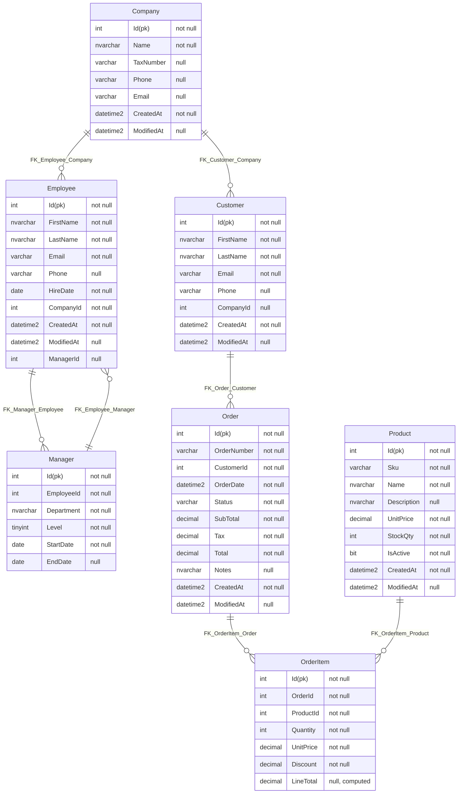

#  DbToMermaid

[](https://ci.appveyor.com/project/SimonCropp/dbtomermaid)
[](https://www.nuget.org/packages/SqlServerToMermaid/)
[](https://www.nuget.org/packages/SqlServerToMermaidTool/)
[](https://www.nuget.org/packages/EfToMermaid/)

Generate [Mermaid ER diagrams](https://mermaid.js.org/syntax/entityRelationshipDiagram.html) from SQL Server databases or Entity Framework Core models.


## NuGet

 * SqlServerToMermaid: https://nuget.org/packages/SqlServerToMermaid/
 * SqlServerToMermaidTool: https://nuget.org/packages/SqlServerToMermaidTool/
 * EfToMermaid: https://nuget.org/packages/EfToMermaid/


## SqlServerToMermaid

Renders Mermaid ER diagrams directly from either:

 * A running SQL Server database using [SQL Server Management Objects (SMO)](https://learn.microsoft.com/en-us/sql/relational-databases/server-management-objects-smo/sql-server-management-objects-smo-programming-guide?view=sql-server-ver17).
 * A sql schema script using [SqlScriptDOM](https://github.com/microsoft/SqlScriptDOM)


### Schema

<!-- snippet: SampleSchema -->
<a id='snippet-SampleSchema'></a>
```cs
CREATE TABLE Company
(
    Id          INT IDENTITY(1,1) PRIMARY KEY,
    Name        NVARCHAR(200)   NOT NULL,
    TaxNumber   VARCHAR(50)     NULL,
    Phone       VARCHAR(30)     NULL,
    Email       VARCHAR(255)    NULL,
    CreatedAt   DATETIME2       NOT NULL DEFAULT GETUTCDATE(),
    ModifiedAt  DATETIME2       NULL
);

CREATE TABLE Employee
(
    Id          INT IDENTITY(1,1) PRIMARY KEY,
    FirstName   NVARCHAR(100)   NOT NULL,
    LastName    NVARCHAR(100)   NOT NULL,
    Email       VARCHAR(255)    NOT NULL,
    Phone       VARCHAR(30)     NULL,
    HireDate    DATE            NOT NULL,
    CompanyId   INT             NOT NULL,
    CreatedAt   DATETIME2       NOT NULL DEFAULT GETUTCDATE(),
    ModifiedAt  DATETIME2       NULL,

    CONSTRAINT FK_Employee_Company
      FOREIGN KEY (CompanyId)
      REFERENCES Company(Id),
);

CREATE TABLE Manager
(
    Id          INT IDENTITY(1,1) PRIMARY KEY,
    EmployeeId  INT             NOT NULL,
    Department  NVARCHAR(100)   NOT NULL,
    Level       TINYINT         NOT NULL DEFAULT 1,
    StartDate   DATE            NOT NULL,
    EndDate     DATE            NULL,

    CONSTRAINT FK_Manager_Employee
      FOREIGN KEY (EmployeeId)
      REFERENCES Employee(Id)
);
-- rest of schema omitted from docs
```
<sup><a href='/src/SqlServerToMermaid.Tests/Tests.cs#L45-L89' title='Snippet source file'>snippet source</a> | <a href='#snippet-SampleSchema' title='Start of snippet'>anchor</a></sup>
<!-- endSnippet -->


### Usage

<!-- snippet: SqlServerUsage -->
<a id='snippet-SqlServerUsage'></a>
```cs
var markdown = await SqlServerToMermaid.RenderMarkdown(sqlConnection);
```
<sup><a href='/src/SqlServerToMermaid.Tests/Tests.cs#L8-L12' title='Snippet source file'>snippet source</a> | <a href='#snippet-SqlServerUsage' title='Start of snippet'>anchor</a></sup>
<!-- endSnippet -->


### Result

<!-- include: /SqlServerToMermaid.Tests/Tests.RenderMarkdown.verified.md -->

<!-- endInclude -->


### From SQL Script

Diagrams can also be generated directly from a SQL script string without a database connection:

<!-- snippet: SqlServerScriptUsage -->
<a id='snippet-SqlServerScriptUsage'></a>
```cs
var script = """
    CREATE TABLE Customers (
        Id INT PRIMARY KEY,
        Name NVARCHAR(100) NOT NULL
    );
    """;

var markdown = await SqlServerToMermaid.RenderMarkdownFromScript(script);
```
<sup><a href='/src/SqlServerToMermaid.Tests/Tests.cs#L23-L34' title='Snippet source file'>snippet source</a> | <a href='#snippet-SqlServerScriptUsage' title='Start of snippet'>anchor</a></sup>
<!-- endSnippet -->


## SqlServerToMermaidTool (CLI)

Command-line tool for generating Mermaid ER diagrams from SQL Server databases or scripts.

### Installation

```bash
dotnet tool install -g SqlServerToMermaidTool
```

### Usage

**From a SQL Server database:**
```bash
sql2mermaid "Server=localhost;Database=MyDb;Integrated Security=true" -o schema.md
```

**From a SQL script file:**
```bash
sql2mermaid path/to/schema.sql -o diagram.mmd
```

**From inline SQL:**
```bash
sql2mermaid "CREATE TABLE Users (Id INT PRIMARY KEY, Name NVARCHAR(100))" -o users.md
```

### Options

| Option | Short | Description | Default |
|--------|-------|-------------|---------|
| `--output` | `-o` | Output file path (.md or .mmd) | `schema.md` |
| `--newline` | `-n` | Custom newline sequence (e.g., `\n` or `\r\n`) | System default |

### Output Formats

- `.md` - Markdown with mermaid code block (uses `RenderMarkdown`)
- `.mmd` - Raw mermaid diagram (uses `Render`)


## EfToMermaid

Renders Mermaid ER diagrams from an Entity Framework Core model.


### Model

EF Model

<!-- snippet: Model.cs -->
<a id='snippet-Model.cs'></a>
```cs
class SampleDbContext(DbContextOptions<SampleDbContext> options) :
    DbContext(options)
{
    protected override void OnModelCreating(ModelBuilder modelBuilder)
    {
        modelBuilder
            .Entity<Customer>(builder =>
            {
                builder.ToTable("Customers", "sales");
                builder.HasKey(_ => _.CustomerId);
                builder.Property(_ => _.CustomerId)
                    .HasColumnType("int").IsRequired();
                builder.Property(_ => _.Name)
                    .HasColumnType("nvarchar(50)")
                    .IsRequired();
            });

        modelBuilder
            .Entity<Order>(builder =>
            {
                builder.ToTable("Orders", "sales");
                builder.HasKey(_ => _.OrderId);
                builder.Property(_ => _.OrderId)
                    .HasColumnType("int")
                    .IsRequired();
                builder.Property(_ => _.CustomerId)
                    .HasColumnType("int")
                    .IsRequired();

                builder.HasOne(_ => _.Customer)
                    .WithMany(_ => _.Orders)
                    .HasForeignKey(_ => _.CustomerId)
                    .HasConstraintName("FK_Orders_Customers");
            });
    }
}

sealed class Customer
{
    public int CustomerId { get; set; }
    public string Name { get; set; } = "";
    public List<Order> Orders { get; set; } = [];
}

sealed class Order
{
    public int OrderId { get; set; }
    public int CustomerId { get; set; }
    public Customer Customer { get; set; } = null!;
}
```
<sup><a href='/src/EfToMermaid.Tests/Model.cs#L1-L50' title='Snippet source file'>snippet source</a> | <a href='#snippet-Model.cs' title='Start of snippet'>anchor</a></sup>
<!-- endSnippet -->


### Usage

<!-- snippet: EfUsage -->
<a id='snippet-EfUsage'></a>
```cs
var options = new DbContextOptionsBuilder<SampleDbContext>()
    .UseSqlServer("Fake")
    .Options;

await using var context = new SampleDbContext(options);

var markdown = await EfToMermaid.RenderMarkdown(context.Model);
```
<sup><a href='/src/EfToMermaid.Tests/Tests.cs#L6-L16' title='Snippet source file'>snippet source</a> | <a href='#snippet-EfUsage' title='Start of snippet'>anchor</a></sup>
<!-- endSnippet -->


### Result

<!-- include: EfToMermaid.Tests/Tests.RenderMarkdown.verified.md -->

<!-- endInclude -->


## Features

 * Generates valid Mermaid `erDiagram` syntax
 * Includes all tables with columns and data types
 * Marks primary keys with `(pk)` notation
 * Shows nullability for each column
 * Indicates computed columns with `computed` annotation
 * Renders foreign key relationships
 * Handles custom database schemas (prefixes table names when not `dbo`)
 * Async-first API with cancellation token support
