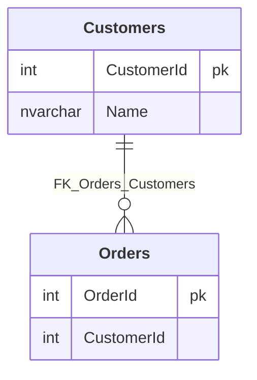

```mermaid
erDiagram
  Customers["**Customers**"] {
    int CustomerId pk
    nvarchar Name
  }
  Orders["**Orders**"] {
    int OrderId pk
    int CustomerId
  }
  Customers ||--o{ Orders : "FK_Orders_Customers"
```
