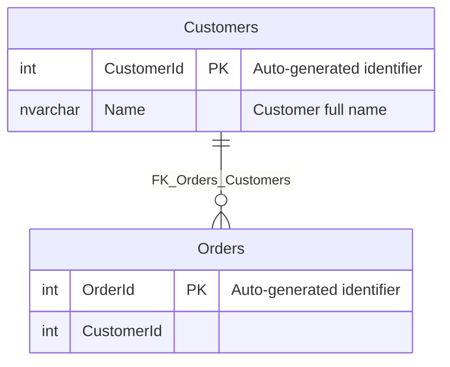

```mermaid
erDiagram
  %% Core customer information
  Customers {
    int CustomerId PK "Auto-generated identifier"
    nvarchar Name "Customer full name"
  }
  %% Customer orders
  Orders {
    int OrderId PK "Auto-generated identifier"
    int CustomerId
  }
  Customers ||--o{ Orders : "FK_Orders_Customers"
```
