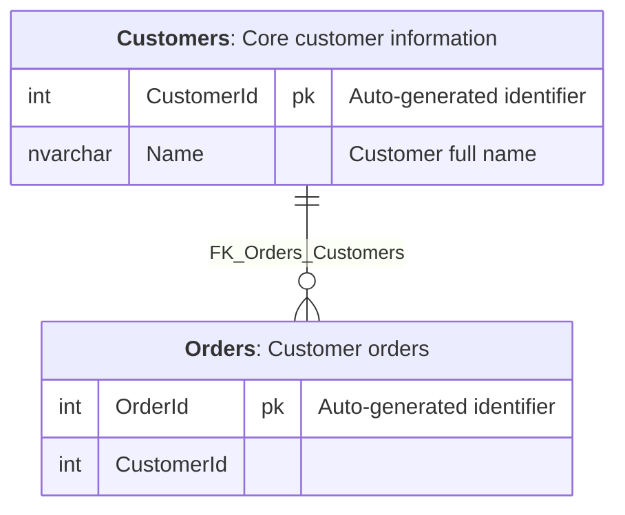

```mermaid
erDiagram
  Customers["**Customers**: Core customer information"] {
    int CustomerId pk "Auto-generated identifier"
    nvarchar Name "Customer full name"
  }
  Orders["**Orders**: Customer orders"] {
    int OrderId pk "Auto-generated identifier"
    int CustomerId
  }
  Customers ||--o{ Orders : "FK_Orders_Customers"
```
