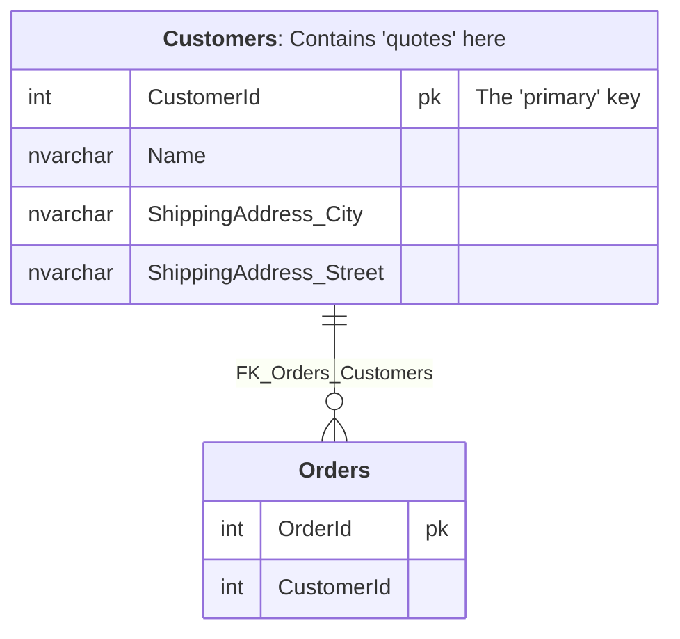

```mermaid
erDiagram
  Customers["**Customers**: Contains 'quotes' here"] {
    int CustomerId pk "The 'primary' key"
    nvarchar Name
    nvarchar ShippingAddress_City
    nvarchar ShippingAddress_Street
  }
  Orders["**Orders**"] {
    int OrderId pk
    int CustomerId
  }
  Customers ||--o{ Orders : "FK_Orders_Customers"
```
