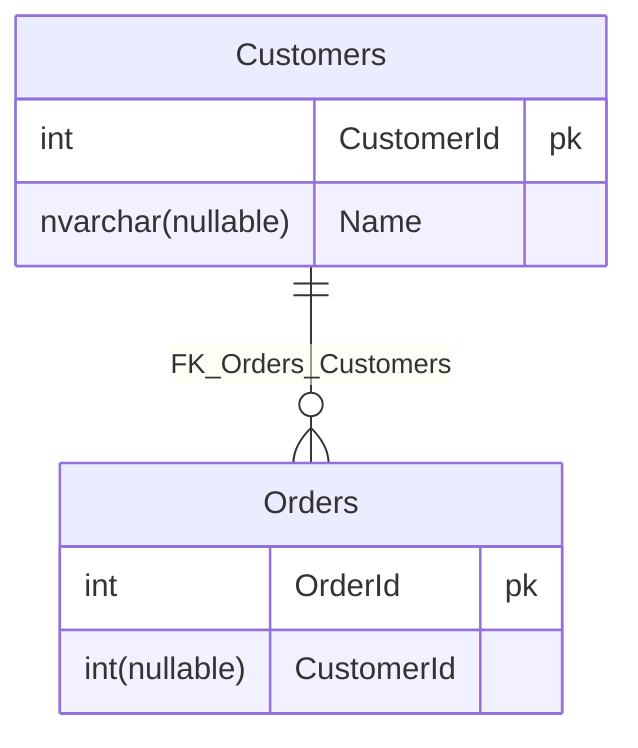

```mermaid
erDiagram
  Customers {
    int CustomerId pk
    nvarchar(nullable) Name
  }
  Orders {
    int OrderId pk
    int(nullable) CustomerId
  }
  Customers ||--o{ Orders : "FK_Orders_Customers"
```
