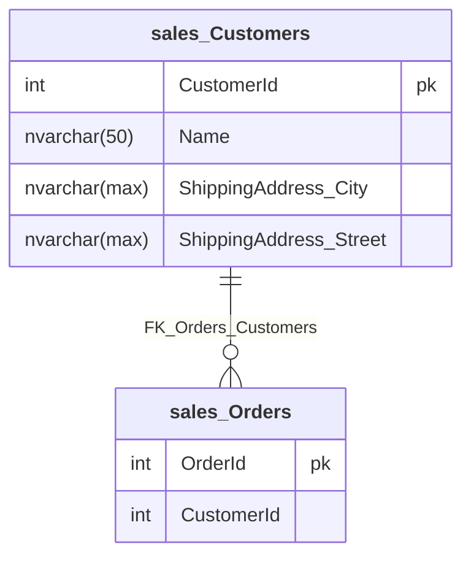



```mermaid
erDiagram
  sales_Customers["**sales_Customers**"] {
    int CustomerId pk
    nvarchar(50) Name
    nvarchar(max) ShippingAddress_City
    nvarchar(max) ShippingAddress_Street
  }
  sales_Orders["**sales_Orders**"] {
    int OrderId pk
    int CustomerId
  }
  sales_Customers ||--o{ sales_Orders : "FK_Orders_Customers"
```