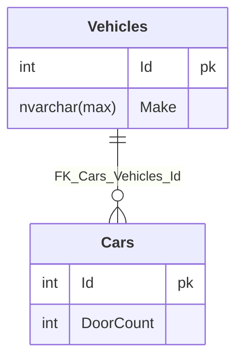



```mermaid
erDiagram
  Cars["**Cars**"] {
    int Id pk
    int DoorCount
  }
  Vehicles["**Vehicles**"] {
    int Id pk
    nvarchar(max) Make
  }
  Vehicles ||--o{ Cars : "FK_Cars_Vehicles_Id"
```