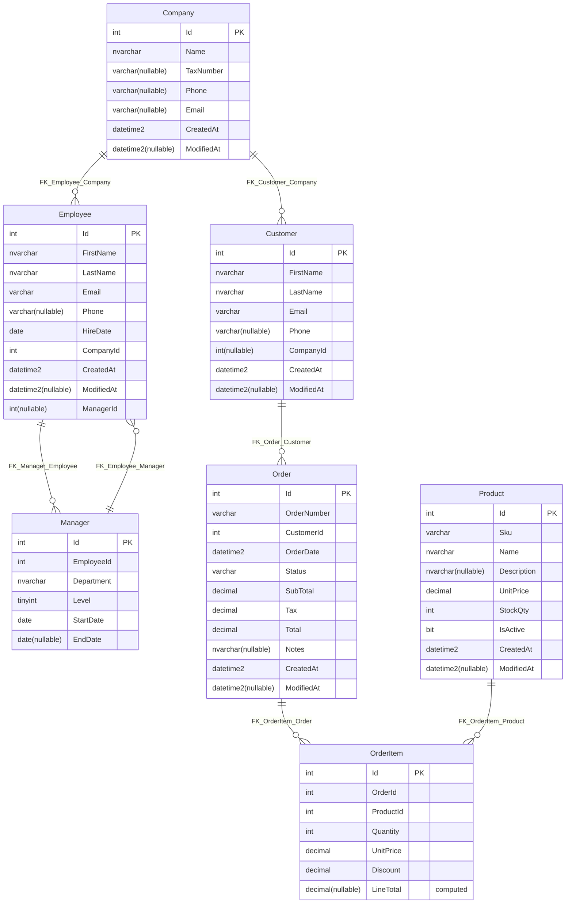

```mermaid
erDiagram
  Company {
    int Id PK
    nvarchar Name
    varchar(nullable) TaxNumber
    varchar(nullable) Phone
    varchar(nullable) Email
    datetime2 CreatedAt
    datetime2(nullable) ModifiedAt
  }
  Customer {
    int Id PK
    nvarchar FirstName
    nvarchar LastName
    varchar Email
    varchar(nullable) Phone
    int(nullable) CompanyId
    datetime2 CreatedAt
    datetime2(nullable) ModifiedAt
  }
  Employee {
    int Id PK
    nvarchar FirstName
    nvarchar LastName
    varchar Email
    varchar(nullable) Phone
    date HireDate
    int CompanyId
    datetime2 CreatedAt
    datetime2(nullable) ModifiedAt
    int(nullable) ManagerId
  }
  Manager {
    int Id PK
    int EmployeeId
    nvarchar Department
    tinyint Level
    date StartDate
    date(nullable) EndDate
  }
  Order {
    int Id PK
    varchar OrderNumber
    int CustomerId
    datetime2 OrderDate
    varchar Status
    decimal SubTotal
    decimal Tax
    decimal Total
    nvarchar(nullable) Notes
    datetime2 CreatedAt
    datetime2(nullable) ModifiedAt
  }
  OrderItem {
    int Id PK
    int OrderId
    int ProductId
    int Quantity
    decimal UnitPrice
    decimal Discount
    decimal(nullable) LineTotal "computed"
  }
  Product {
    int Id PK
    varchar Sku
    nvarchar Name
    nvarchar(nullable) Description
    decimal UnitPrice
    int StockQty
    bit IsActive
    datetime2 CreatedAt
    datetime2(nullable) ModifiedAt
  }
  Company ||--o{ Customer : "FK_Customer_Company"
  Company ||--o{ Employee : "FK_Employee_Company"
  Customer ||--o{ Order : "FK_Order_Customer"
  Employee ||--o{ Manager : "FK_Manager_Employee"
  Manager ||--o{ Employee : "FK_Employee_Manager"
  Order ||--o{ OrderItem : "FK_OrderItem_Order"
  Product ||--o{ OrderItem : "FK_OrderItem_Product"
```
