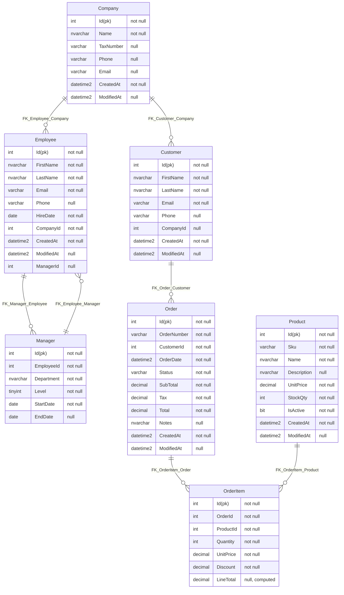

```mermaid
erDiagram
  Company {
    int Id(pk) "not null"
    nvarchar Name "not null"
    varchar TaxNumber "null"
    varchar Phone "null"
    varchar Email "null"
    datetime2 CreatedAt "not null"
    datetime2 ModifiedAt "null"
  }
  Customer {
    int Id(pk) "not null"
    nvarchar FirstName "not null"
    nvarchar LastName "not null"
    varchar Email "not null"
    varchar Phone "null"
    int CompanyId "null"
    datetime2 CreatedAt "not null"
    datetime2 ModifiedAt "null"
  }
  Employee {
    int Id(pk) "not null"
    nvarchar FirstName "not null"
    nvarchar LastName "not null"
    varchar Email "not null"
    varchar Phone "null"
    date HireDate "not null"
    int CompanyId "not null"
    datetime2 CreatedAt "not null"
    datetime2 ModifiedAt "null"
    int ManagerId "null"
  }
  Manager {
    int Id(pk) "not null"
    int EmployeeId "not null"
    nvarchar Department "not null"
    tinyint Level "not null"
    date StartDate "not null"
    date EndDate "null"
  }
  Order {
    int Id(pk) "not null"
    varchar OrderNumber "not null"
    int CustomerId "not null"
    datetime2 OrderDate "not null"
    varchar Status "not null"
    decimal SubTotal "not null"
    decimal Tax "not null"
    decimal Total "not null"
    nvarchar Notes "null"
    datetime2 CreatedAt "not null"
    datetime2 ModifiedAt "null"
  }
  OrderItem {
    int Id(pk) "not null"
    int OrderId "not null"
    int ProductId "not null"
    int Quantity "not null"
    decimal UnitPrice "not null"
    decimal Discount "not null"
    decimal LineTotal "null, computed"
  }
  Product {
    int Id(pk) "not null"
    varchar Sku "not null"
    nvarchar Name "not null"
    nvarchar Description "null"
    decimal UnitPrice "not null"
    int StockQty "not null"
    bit IsActive "not null"
    datetime2 CreatedAt "not null"
    datetime2 ModifiedAt "null"
  }
  Company ||--o{ Customer : "FK_Customer_Company"
  Company ||--o{ Employee : "FK_Employee_Company"
  Customer ||--o{ Order : "FK_Order_Customer"
  Employee ||--o{ Manager : "FK_Manager_Employee"
  Manager ||--o{ Employee : "FK_Employee_Manager"
  Order ||--o{ OrderItem : "FK_OrderItem_Order"
  Product ||--o{ OrderItem : "FK_OrderItem_Product"
```
