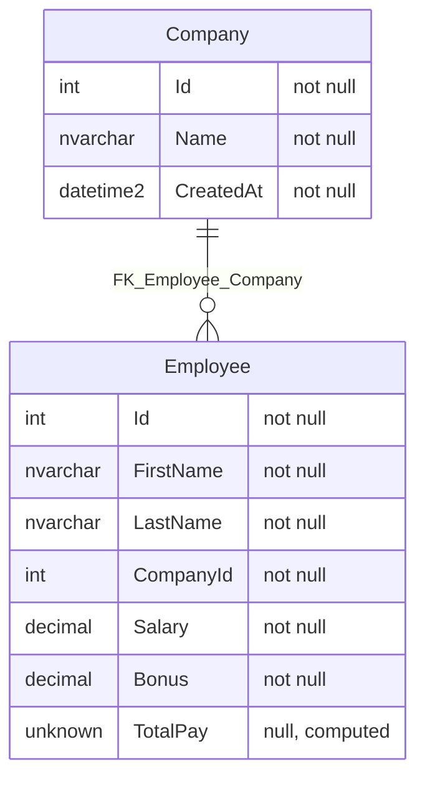

```mermaid
erDiagram
  Company {
    int Id "not null"
    nvarchar Name "not null"
    datetime2 CreatedAt "not null"
  }
  Employee {
    int Id "not null"
    nvarchar FirstName "not null"
    nvarchar LastName "not null"
    int CompanyId "not null"
    decimal Salary "not null"
    decimal Bonus "not null"
    unknown TotalPay "null, computed"
  }
  Company ||--o{ Employee : "FK_Employee_Company"
```
