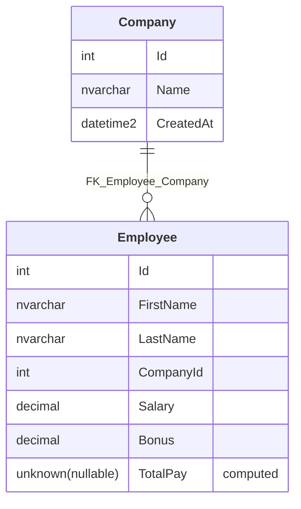

```mermaid
erDiagram
  Company["**Company**"] {
    int Id
    nvarchar Name
    datetime2 CreatedAt
  }
  Employee["**Employee**"] {
    int Id
    nvarchar FirstName
    nvarchar LastName
    int CompanyId
    decimal Salary
    decimal Bonus
    unknown(nullable) TotalPay "computed"
  }
  Company ||--o{ Employee : "FK_Employee_Company"
```
