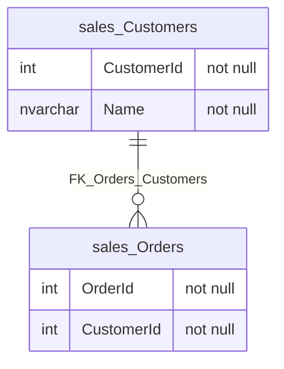

```mermaid
erDiagram
  sales_Customers {
    int CustomerId "not null"
    nvarchar Name "not null"
  }
  sales_Orders {
    int OrderId "not null"
    int CustomerId "not null"
  }
  sales_Customers ||--o{ sales_Orders : "FK_Orders_Customers"
```
