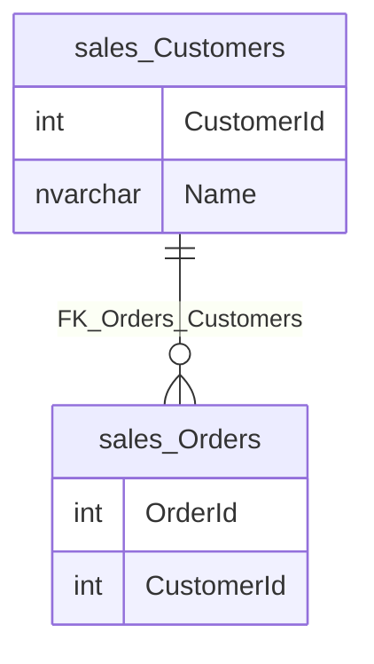

```mermaid
erDiagram
  sales_Customers {
    int CustomerId
    nvarchar Name
  }
  sales_Orders {
    int OrderId
    int CustomerId
  }
  sales_Customers ||--o{ sales_Orders : "FK_Orders_Customers"
```
