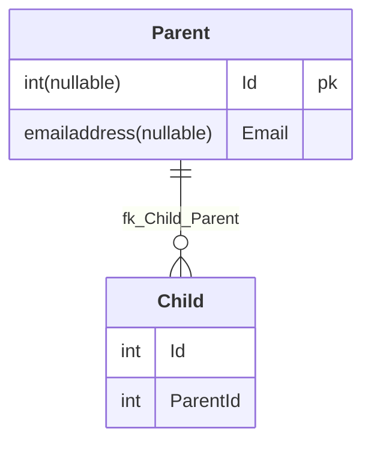

```mermaid
erDiagram
  Child["**Child**"] {
    int Id
    int ParentId
  }
  Parent["**Parent**"] {
    int(nullable) Id pk
    emailaddress(nullable) Email
  }
  Parent ||--o{ Child : "fk_Child_Parent"
```
