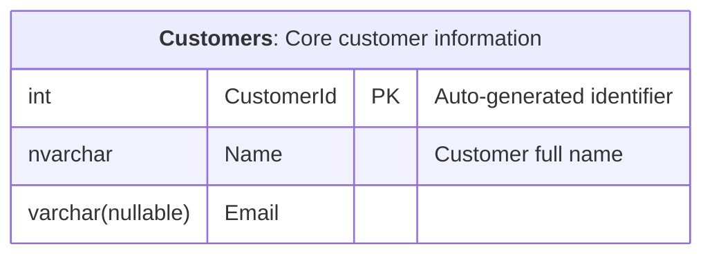

```mermaid
erDiagram
  Customers["**Customers**: Core customer information"] {
    int CustomerId PK "Auto-generated identifier"
    nvarchar Name "Customer full name"
    varchar(nullable) Email
  }
```
