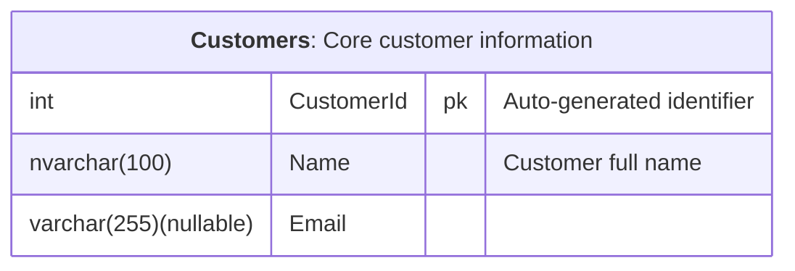



```mermaid
erDiagram
  Customers["**Customers**: Core customer information"] {
    int CustomerId pk "Auto-generated identifier"
    nvarchar(100) Name "Customer full name"
    varchar(255)(nullable) Email
  }
```