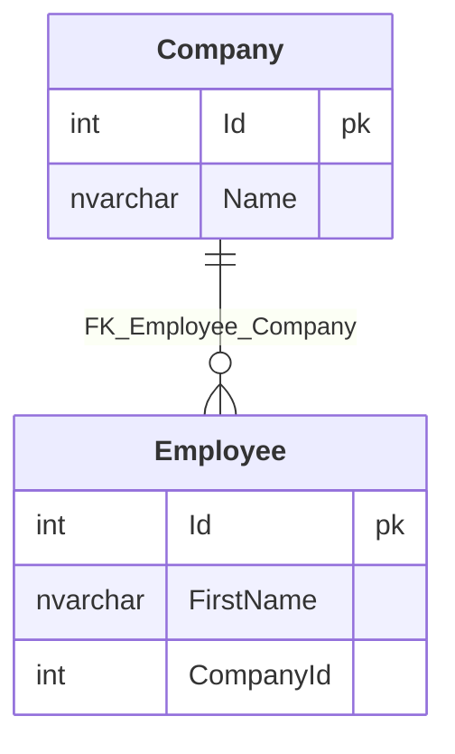

```mermaid
erDiagram
  Company["**Company**"] {
    int Id pk
    nvarchar Name
  }
  Employee["**Employee**"] {
    int Id pk
    nvarchar FirstName
    int CompanyId
  }
  Company ||--o{ Employee : "FK_Employee_Company"
```
