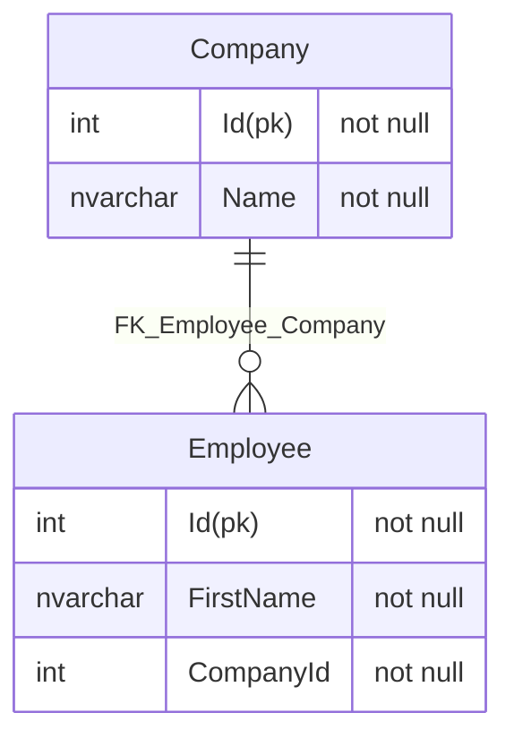

```mermaid
erDiagram
  Company {
    int Id(pk) "not null"
    nvarchar Name "not null"
  }
  Employee {
    int Id(pk) "not null"
    nvarchar FirstName "not null"
    int CompanyId "not null"
  }
  Company ||--o{ Employee : "FK_Employee_Company"
```
